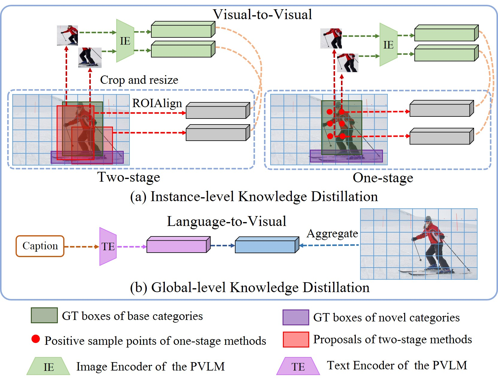

# Open-Vocabulary One-Stage Detection with Hierarchical Visual-Language Knowledge Distillation

## Introduction

<!--  -->


## Installation

Install Pytorch 1.7+

```sh
conda install -c pytorch pytorch torchvision
```

Follow the official instruction to install the MMdetection

```sh
https://github.com/open-mmlab/mmdetection
```

Install the CLIP requirement

```sh
pip install ftfy regex tqdm
```

## Data Prepare